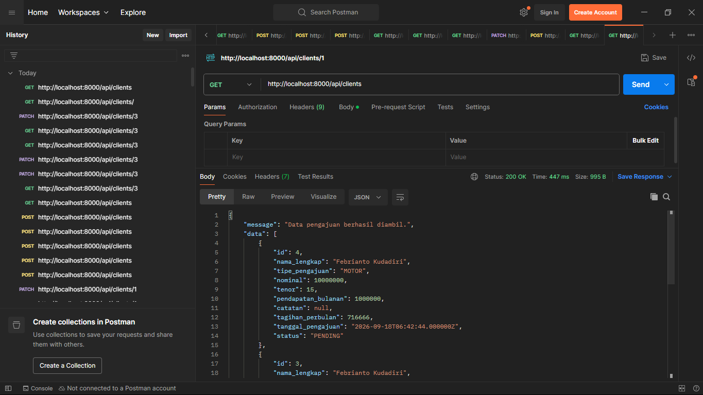
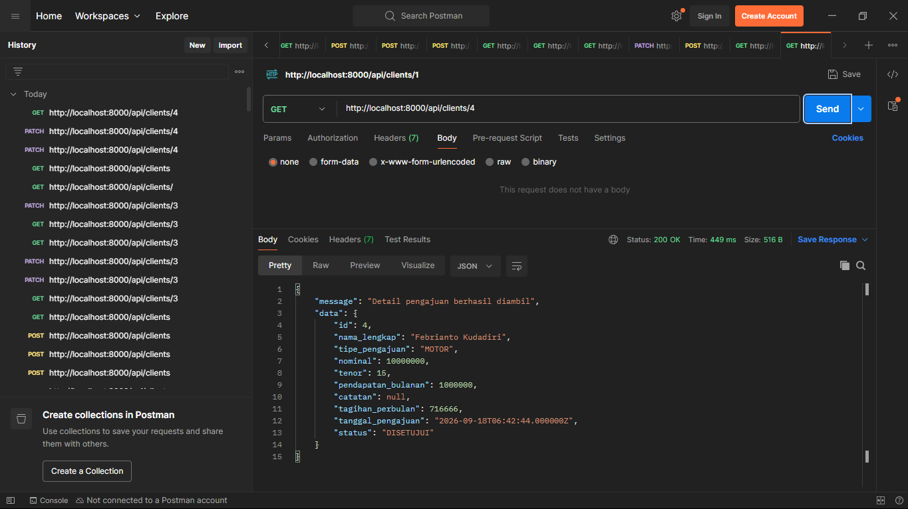
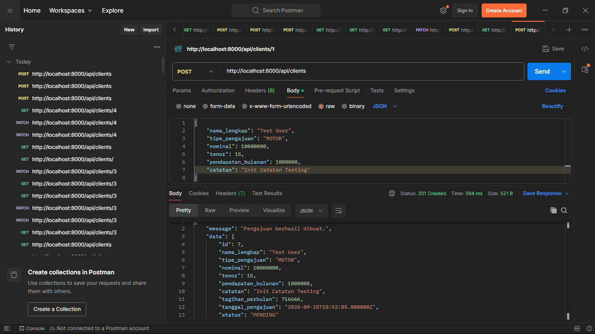
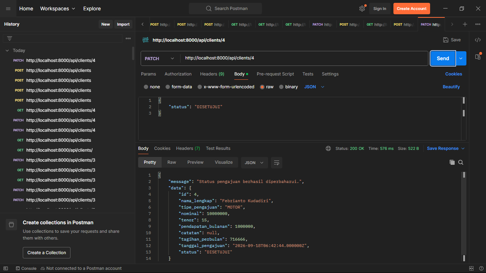

# CMD Credit Application

Aplikasi web internal untuk mengelola pengajuan pembiayaan nasabah di PT Capella Multidana.

Aplikasi ini memungkinkan pengguna internal untuk mencatat pengajuan pembiayaan nasabah, melihat daftar pengajuan, melihat detail pengajuan, serta mengubah status pengajuan menjadi disetujui atau ditolak.

---

## Gambaran Umum

CMD Credit Application merupakan aplikasi full-stack yang dibuat sebagai bagian dari coding test untuk posisi **Junior Fullstack Developer**.

Aplikasi ini berfokus pada alur sederhana pengelolaan pengajuan pembiayaan:

1. Membuat pengajuan pembiayaan baru.
2. Menampilkan daftar pengajuan.
3. Melihat detail pengajuan.
4. Menghitung estimasi cicilan per bulan.
5. Menyetujui atau menolak pengajuan.
6. Menerapkan validasi dan aturan bisnis yang ditentukan.

Aplikasi menggunakan **React** sebagai frontend dan **Laravel** sebagai REST API backend dengan **PostgreSQL** sebagai database penyimpanan data.

---

## Fitur

### Pengelolaan Pengajuan

- Membuat pengajuan pembiayaan baru.
- Melihat daftar seluruh pengajuan.
- Melihat detail pengajuan.
- Menghitung estimasi cicilan per bulan.
- Menyetujui pengajuan.
- Menolak pengajuan.
- Menampilkan dialog konfirmasi sebelum mengubah status pengajuan.
- Menampilkan status pengajuan.

### Validasi dan Aturan Bisnis

- Pendapatan bulanan minimal Rp1.000.000.
- Maksimal nominal yang dapat disetujui adalah Rp200.000.000.
- Maksimal tenor adalah 24 bulan.
- Maksimal 3 pengajuan untuk setiap nasabah.
- Validasi dilakukan pada backend.
- Pesan kesalahan ditampilkan pada frontend.

### Antarmuka

- Tampilan responsif.
- Antarmuka sederhana dan bersih.
- Menggunakan **Tailwind CSS**.
- Loading state.
- Empty state.
- Pemberitahuan berhasil atau gagal.
- Dialog konfirmasi untuk aksi persetujuan dan penolakan.

---

## Aturan Bisnis

Berikut adalah aturan bisnis yang diterapkan berdasarkan ketentuan coding test.

| Aturan                                | Ketentuan               |
| ------------------------------------- |-------------------------|
| Pendapatan minimum                    | Rp1.000.000 per bulan   |
| Maksimal nominal yang dapat disetujui | Rp200.000.000           |
| Maksimal tenor                        | 24 bulan                |
| Maksimal jumlah pengajuan             | 3 pengajuan per nasabah |
| Status awal                           | `PENDING`               |
| Status disetujui                      | `DISETUJUI`             |
| Status ditolak                        | `DITOLAK`               |

### Pendapatan Minimum

Apabila pendapatan bulanan nasabah kurang dari Rp1.000.000, maka pengajuan tidak dapat dibuat.

Pesan yang ditampilkan:

> Nasabah belum dapat mengajukan pinjaman.

### Maksimal Nominal Pengajuan yang Dapat Disetujui

Maksimal nominal yang dapat **disetujui** adalah Rp200.000.000.

Pengajuan dengan nominal lebih dari Rp200.000.000 masih dapat dicatat sebagai pengajuan, tetapi tidak dapat diubah menjadi status `APPROVED`.

### Maksimal Tenor

Tenor maksimal pengajuan adalah 24 bulan.

### Maksimal Jumlah Pengajuan

Setiap nasabah dapat memiliki maksimal 3 pengajuan.

Karena form yang diberikan tidak menyediakan identitas unik seperti **Customer ID** atau **NIK**, implementasi saat ini menggunakan nama lengkap nasabah yang telah dinormalisasi sebagai identitas sederhana untuk menghitung jumlah pengajuan.

---

## Perhitungan Cicilan Per Bulan

Aplikasi menghitung estimasi cicilan per bulan berdasarkan nominal pengajuan dan tenor.

Perhitungan menggunakan bunga tahunan sederhana sebesar 6%.

```text
Total Pembayaran =
Nominal × (1 + Bunga Tahunan × (Tenor / 12))

Cicilan Per Bulan = Total Pembayaran / Tenor
```

Contoh:

```text
Nominal : Rp12.000.000
Tenor   : 12 bulan
Bunga   : 6% per tahun

Total Pembayaran
= 12.000.000 × (1 + 0,06 × (12 / 12))
= Rp12.720.000

Cicilan Per Bulan
= 12.720.000 / 12
= Rp1.060.000
```

> Perhitungan bunga tersebut merupakan asumsi perhitungan, untuk kebutuhan coding test dan bukan merupakan perhitungan pembiayaan resmi.

---

## Teknologi yang Digunakan

### Frontend

- React dengan JavaScript
- Tailwind CSS
- Axios
- React Router Dom
- SweetAlert2
- Vite

### Backend

- Laravel 12.0
- PHP 8.2
- Eloquent ORM
- Laravel REST API
- Form Request Validation
- API Resource
- PHP Enum

### Database

- PostgreSQL

### Testing

- PHPUnit
- Vitest
- React Testing Library
- Testing Library User Event

---

## Struktur Project

```text
Internal_Credit_Application_Management_System/
│
├── backend/
│   ├── app/
│   │   ├── Enums/
│   │   ├── Http/
│   │   │   ├── Controllers/
│   │   │   ├── Requests/
│   │   │   └── Resources/
│   │   ├── Models/
│   │   ├── Services/
│   │   └── Support/
│   │
│   ├── database/
│   │   ├── factories/
│   │   └── migrations/
│   │
│   ├── routes/
│   │   └── api.php
│   │
│   └── tests/
│       ├── Feature/
│       └── Unit/
│
├── frontend/
│   ├── src/
│   │   ├── components/
│   │   │   ├── client_detail/
│   │   │   └── home/
│   │   ├── features/
│   │   │   ├── api/
│   │   │   └── client/
│   │   ├── pages/
│   │   ├── test/
│   │   ├── utils/
│   │   ├── App.jsx
│   │   ├── main.jsx
│   │   └── RootProvider.jsx
│   │
│   └── package.json
│
└── README.md
```

> Struktur folder di atas merupakan tempat penyimpanan file-file yang digunakan selama proses pengembangan.

---

## Kebutuhan Sistem

Sebelum menjalankan aplikasi, pastikan perangkat telah memiliki:

- PHP 8.x
- Composer
- Node.js
- npm
- PostgreSQL

Versi yang digunakan dalam pengembangan:

```text
PHP        : 8.x
Node.js    : 22.x
npm        : 10.x
PostgreSQL : 17.x
```

> Sesuaikan versi di atas dengan versi aktual yang digunakan pada project sebelum repository dikumpulkan.

---

# Instalasi dan Konfigurasi

## 1. Clone Repository

```bash
git clone https://github.com/EgoEquusFebrianto/Internal_Credit_Application_Management_System.git
cd Internal_Credit_Application_Management_System
```

Project terdiri dari dua aplikasi utama:

```text
backend/
frontend/
```

---

# Konfigurasi Backend

Masuk ke folder backend:

```bash
cd backend
```

Install dependency Laravel:

```bash
composer install
```

Salin file environment:

```bash
cp .env.example .env
```

Generate application key:

```bash
php artisan key:generate
```

Kemudian konfigurasi database pada file `.env`.

Contoh:

```env
APP_NAME="CMD Credit Application"
APP_ENV=local
APP_DEBUG=true
APP_URL=http://127.0.0.1:8000

DB_CONNECTION=pgsql
DB_HOST=127.0.0.1
DB_PORT=5432
DB_DATABASE=cmd_credit_application
DB_USERNAME=your_username
DB_PASSWORD=your_password
```

Jalankan migration (pastikan database sudah tersedia terlebih dahulu):

```bash
php artisan migrate
```

---

# Konfigurasi Frontend

Masuk ke folder frontend:

```bash
cd frontend
```

Install dependency:

```bash
npm install
```

frontend menggunakan environment variable untuk URL API, pastikan file `.env`:

```env
VITE_API_URL=http://127.0.0.1:8000/api
```

---

# Konfigurasi Database

Buat database PostgreSQL (contoh):

```sql
CREATE DATABASE cmd_credit_application;
```

Kemudian sesuaikan konfigurasi database pada file `.env` Laravel.

Jalankan migration:

```bash
php artisan migrate
```

Untuk membuat ulang database dari awal (jika perlu):

```bash
php artisan migrate:fresh
```

> Gunakan `migrate:fresh` hanya ketika database dapat di-reset karena perintah tersebut akan menghapus tabel yang ada.

---

# Menjalankan Aplikasi

Backend dan frontend dijalankan secara terpisah pada saat development.

## Backend

Dari folder `backend`:

```bash
php artisan serve
```

Secara default Laravel akan berjalan pada:

```text
http://127.0.0.1:8000
```

Base URL API:

```text
http://127.0.0.1:8000/api
```

## Frontend

Dari folder `frontend`:

```bash
npm run dev
```

Vite biasanya menjalankan frontend pada:

```text
http://localhost:5173
```

Buka URL tersebut melalui browser.

---

# API

API menggunakan arsitektur REST.

| Method  | Endpoint            | Keterangan                    |
| ------- | ------------------- | ----------------------------- |
| `GET`   | `/api/clients`      | Mendapatkan seluruh pengajuan |
| `GET`   | `/api/clients/{id}` | Mendapatkan detail pengajuan  |
| `POST`  | `/api/clients`      | Membuat pengajuan baru        |
| `PATCH` | `/api/clients/{id}` | Mengubah status pengajuan     |

---

## Mendapatkan Daftar Pengajuan

### Request

```http
GET /api/clients
```

### Keterangan

Mengambil seluruh data pengajuan pembiayaan nasabah.

### Contoh Hasil



---

## Mendapatkan Detail Pengajuan

### Request

```http
GET /api/clients/{id}
```

### Keterangan

Mengambil detail pengajuan berdasarkan ID, termasuk estimasi cicilan per bulan.

### Contoh Hasil



---

## Membuat Pengajuan

### Request

```http
POST /api/clients
Content-Type: application/json
```

### Request Body

```json
{
    "nama_lengkap": "Test User",
    "tipe_pengajuan": "MOTOR",
    "nominal": 10000000,
    "tenor": 15,
    "pendapatan_bulanan": 1000000,
    "catatan": "Init Catatan Testing"
}
```

### Tipe Pengajuan

```text
MOTOR
MOBIL
MULTIGUNA
```

### Response Berhasil

```text
HTTP 201 Created
```

Setiap pengajuan baru memiliki status awal:

```text
PENDING
```

### Contoh Hasil



---

## Mengubah Status Pengajuan

### Request

```http
PATCH /api/clients/{id}
Content-Type: application/json
```

### Menyetujui Pengajuan

```json
{
    "status": "DISETUJUI"
}
```

### Menolak Pengajuan

```json
{
    "status": "DITOLAK"
}
```

### Status Pengajuan

```text
PENDING
DISETUJUI
DITOLAK
```

Backend akan melakukan pemeriksaan terhadap aturan bisnis sebelum status diubah.

### Contoh Hasil



---

# Testing

Project memiliki automated testing pada backend dan frontend.

## Backend Testing

Backend testing digunakan untuk memverifikasi API dan aturan bisnis.

Menjalankan seluruh test:

```bash
php artisan test
```

Test mencakup beberapa skenario:

- Berhasil membuat pengajuan yang valid.
- Menolak pengajuan dengan pendapatan di bawah Rp1.000.000.
- Menolak tenor yang melebihi 24 bulan.
- Mencegah nasabah memiliki lebih dari 3 pengajuan.
- Mencegah pengajuan di atas Rp200.000.000 untuk disetujui.
- Memverifikasi perhitungan cicilan per bulan.

---

## Frontend Testing

Frontend testing berfokus pada perilaku komponen, khususnya `ApplicationForm`.

Menjalankan test:

```bash
npm run test:run
```

Test mencakup:

- Memastikan data yang dikirim memiliki format yang benar.
- Memastikan nilai nominal, tenor, dan pendapatan dikonversi menjadi number.
- Memastikan form tidak di-reset ketika proses pengajuan tidak berhasil.
- Memastikan form di-reset setelah pengajuan berhasil.

Business rules utama tetap diuji pada backend sehingga validasi tidak hanya bergantung pada frontend.

---

# Alur Aplikasi

## Membuat Pengajuan

```text
User
 │
 ▼
Form Pengajuan
 │
 ▼
React Frontend
 │
 │ POST /api/clients
 ▼
Laravel REST API
 │
 ▼
Form Request Validation
 │
 ▼
Client Service
 │
 ├── Validasi pendapatan
 ├── Validasi jumlah pengajuan
 └── Membuat pengajuan
 │
 ▼
PostgreSQL
 │
 ▼
API Response
 │
 ▼
Tabel Pengajuan
```

## Menyetujui / Menolak Pengajuan

```text
User
 │
 ▼
Tombol Setujui / Tolak
 │
 ▼
Dialog Konfirmasi
 │
 ├── Batal → Proses berhenti
 │
 └── Konfirmasi
       │
       ▼
  PATCH /api/clients/{id}
       │
       ▼
  Laravel REST API
       │
       ▼
  Pemeriksaan Aturan Bisnis
       │
       ▼
  Update Status
       │
       ▼
  PostgreSQL
       │
       ▼
  Data Pengajuan Diperbarui
```

---

# Alur Status Pengajuan

Status pengajuan menggunakan alur:

```text
PENDING
   │
   ├──────────────► DISETUJUI
   │
   └──────────────► DITOLAK
```

`PENDING` merupakan status awal ketika pengajuan dibuat.

`DISETUJUI` dan `DITOLAK` merupakan hasil dari proses review pengajuan.

---

# Arsitektur

Aplikasi menggunakan pemisahan sederhana antara presentation layer, komunikasi API, dan business logic.

```text
┌────────────────────────────┐
│       React Frontend       │
│                            │
│ Pages                      │
│ Components                 │
│ Context / Hooks            │
│ Services                   │
└─────────────┬──────────────┘
              │
              │ HTTP / REST API
              ▼
┌────────────────────────────┐
│       Laravel Backend      │
│                            │
│ Controllers                │
│ Form Requests              │
│ Resources                  │
│ Services                   │
│ Models / Eloquent          │
└─────────────┬──────────────┘
              │
              │ SQL
              ▼
┌────────────────────────────┐
│         PostgreSQL         │
└────────────────────────────┘
```

Aturan bisnis utama ditempatkan pada backend sehingga validasi tetap dapat diterapkan meskipun request dikirim secara langsung ke API tanpa melalui frontend.

---

# Asumsi

Beberapa asumsi dibuat karena spesifikasi coding test tidak menjelaskan seluruh detail implementasi.

## Identitas Nasabah

Form pengajuan tidak menyediakan Customer ID, NIK, atau identitas unik lainnya.

Oleh karena itu, implementasi saat ini menggunakan nama lengkap nasabah yang telah dinormalisasi untuk menentukan jumlah pengajuan yang dimiliki oleh seorang nasabah.

Pada sistem production, penggunaan identitas unik akan lebih tepat.

## Maksimal Nominal yang Dapat Disetujui

Spesifikasi menyebutkan bahwa maksimal nominal pinjaman yang dapat disetujui adalah Rp200.000.000.

Implementasi menggunakan interpretasi:

* Pengajuan di atas Rp200.000.000 masih dapat dicatat.
* Pengajuan di atas Rp200.000.000 tidak dapat disetujui.
* Pengajuan tepat Rp200.000.000 dapat disetujui.

## Perhitungan Bunga

Perhitungan cicilan menggunakan bunga sederhana sebesar 6% per tahun untuk kebutuhan coding test.

Perhitungan tersebut bukan merupakan representasi dari perhitungan pembiayaan resmi PT Capella Multidana.

---

# Penanganan Error

Aplikasi menangani validation error dan business rule error melalui response dari REST API.

Untuk validation error, backend mengembalikan HTTP status:

```text
422 Unprocessable Entity
```

Contoh response:

```json
{
    "message": "Nasabah belum dapat mengajukan pinjaman."
}
```

Frontend kemudian menampilkan pesan tersebut melalui notifikasi yang lebih mudah dipahami pengguna.

Untuk operasi yang berhasil, frontend menampilkan notifikasi keberhasilan.

---

# Catatan Pengembangan

Aplikasi sengaja menggunakan arsitektur yang sederhana agar tetap fokus terhadap kebutuhan coding test dan mudah dipelihara.

Teknologi dan dependency yang tidak diperlukan tidak ditambahkan untuk menjaga kompleksitas project tetap rendah.

Fokus utama implementasi adalah:

* Struktur kode yang bersih.
* Pemisahan tanggung jawab antar bagian aplikasi.
* Validasi business rule pada backend.
* Komunikasi menggunakan REST API.
* Antarmuka yang sederhana dan konsisten.
* Error handling.
* Automated testing dasar.
* Dokumentasi project.

---

# Lisensi / License

## ⚠️ Peringatan Penggunaan

> **Proyek ini dikembangkan secara khusus untuk keperluan coding test / technical assessment dan tidak dirancang untuk digunakan secara langsung di lingkungan production.**
>
> Penggunaan dalam lingkungan production memerlukan tinjauan dan pengembangan lebih lanjut, khususnya pada aspek keamanan, autentikasi dan otorisasi, aturan bisnis, validasi, pengelolaan data, serta infrastruktur.

## ⚠️ Usage Warning

> **This project was developed specifically for a coding test / technical assessment and is not intended for direct use in a production environment.**
>
> Production usage would require further review and development, particularly in the areas of security, authentication and authorization, business rules, validation, data management, and infrastructure.